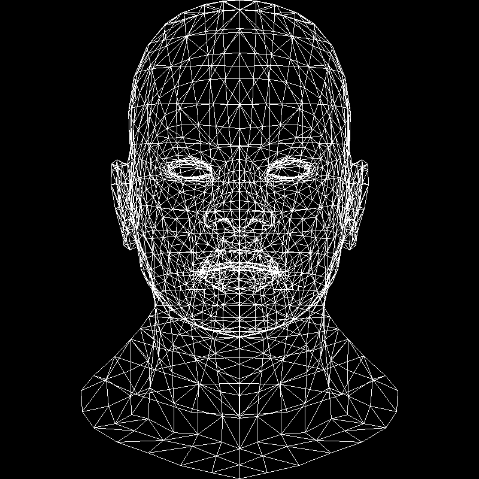
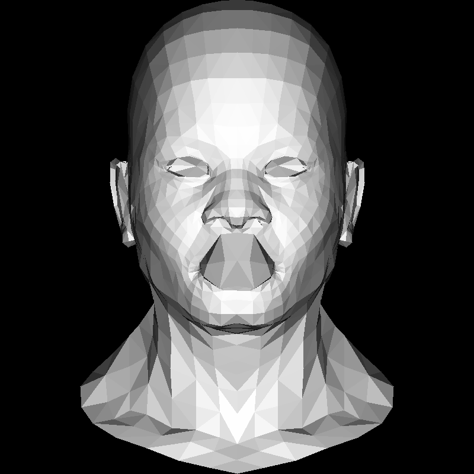
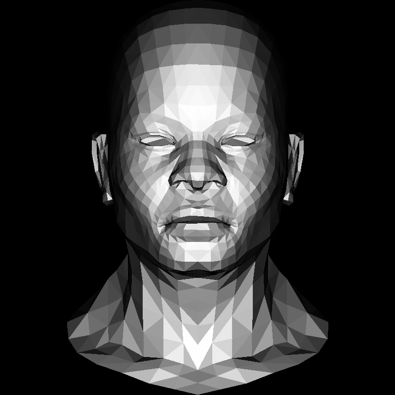
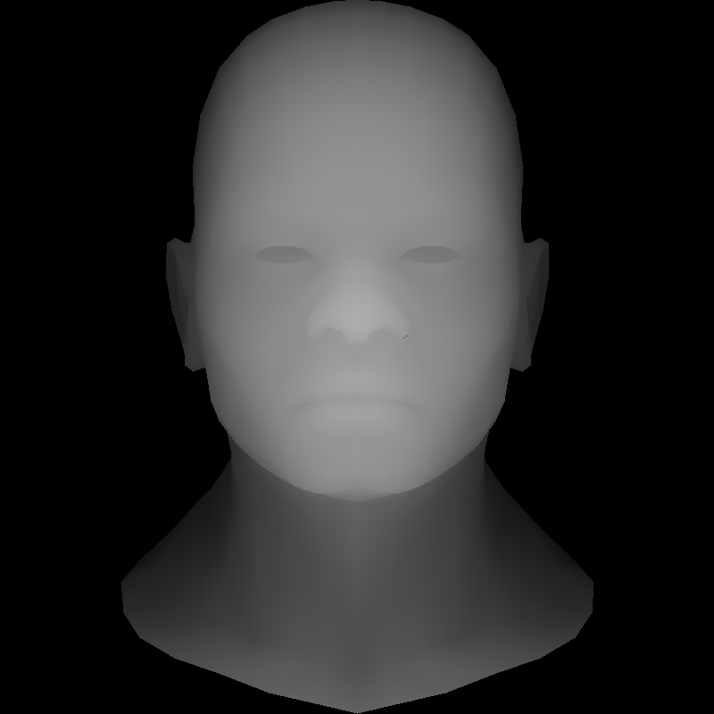

[github.com/ssloy/tinyrenderer/wiki]()

# Outputs

| Lesson 1: Line Drawing | Lesson 2: Triangle rasterization   & Back face culling |
| - | - |
| |  |

| Lesson 3: Hidden faces removal   & Gamma correction | Visualized z buffer |
| - | - |
|  |  |